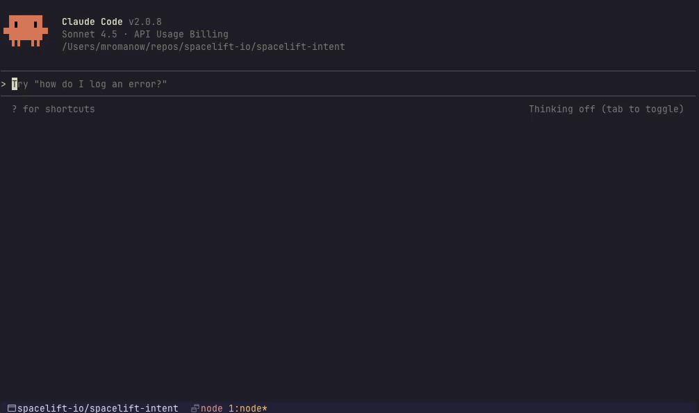
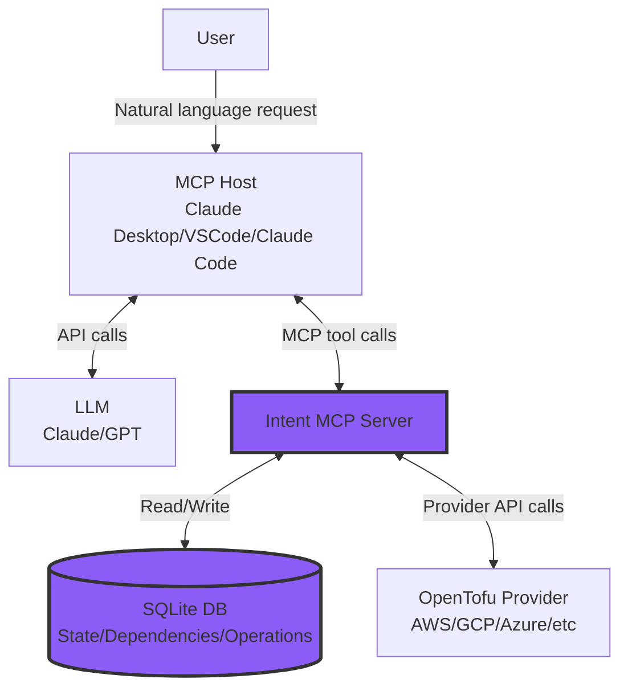

# Spacelift Intent


Spacelift Intent is an MCP Server that lets you define cloud resources in natural language and have them provisioned by directly calling provider APIs - no OpenTofu or Terraform code required.
- Perfect for prototyping - Quickly test and iterate without writing or committing IaC code.
- Full state tracking - every resource is recorded for consistent management across sessions. View and manage all created resources.
- Managed version available on the [Spacelift Platform](https://spacelift.io/intent) - with policies and auditing.

While OpenTofu and Terraform remains king for production use, with Intent you can get up and running much quicker, and spend time on productionizing later.

Note: the project is experimental, and feedback is welcome! Leave questions, ideas, or bug reports in the [GitHub Discussions tab](https://github.com/spacelift-io/spacelift-intent/discussions/categories/general).




## Table of contents

- [Installation](#installation)
  - [VSCode](#vscode)
  - [Claude Desktop](#claude-desktop)
  - [Claude Code](#claude-code)
- [Configuration](#configuration)
  - [Flags](#flags)
- [Tools](#tools)
- [Architecture](#architecture)
- [Building from Source](#building-from-source)

## Installation

**Prerequisites**:
- A compatible [MCP host](https://modelcontextprotocol.io/docs/learn/architecture#concepts-of-mcp) that supports **stdio** servers.

### Docker (Recommended)

The easiest way to run Intent is using Docker:

```bash
docker pull ghcr.io/spacelift-io/spacelift-intent:latest
```

Configure your MCP host to use the Docker container. See the [Configuration](#configuration) section for provider credentials setup.

### Homebrew

Install via Homebrew:

```bash
brew install spacelift-io/spacelift/spacelift-intent
```

### Manual Installation

Download the newest binary from the [Releases](https://github.com/spacelift-io/spacelift-intent/releases) page.

## MCP Host Configuration

Currently, we support running the server in:

### VSCode

> Enable [MCP support](https://code.visualstudio.com/docs/copilot/customization/mcp-servers#_enable-mcp-support-in-vs-code)

**Using Docker:**
```bash
code --add-mcp "{\"name\":\"spacelift-intent\", \
  \"command\": \"docker\", \
  \"args\": [ \
    \"run\", \"-i\", \"--rm\", \
    \"-e\", \"DB_DIR=/state\", \
    \"-v\", \"${HOME}/.spacelift-intent:/state\", \
    \"ghcr.io/spacelift-io/spacelift-intent:latest\" \
  ]}"
```

**Using Homebrew or local binary:**
```bash
code --add-mcp "{\"name\":\"spacelift-intent\",\"command\": \"spacelift-intent\"}"
```

### Claude Desktop

Add the following configuration to your *Claude Desktop* config file:

**macOS**: `~/Library/Application Support/Claude/claude_desktop_config.json`
**Windows**: `%APPDATA%\Claude\claude_desktop_config.json`
**Linux**: `~/.config/claude/claude_desktop_config.json`

**Using Docker:**
```json
{
    "mcpServers": {
        "spacelift-intent": {
            "command": "docker",
            "args": [
                "run", "-i", "--rm",
                "-e", "DB_DIR=/state",
                "-v", "<USER-HOME-DIR>/.spacelift-intent:/state",
                "ghcr.io/spacelift-io/spacelift-intent:latest"
            ]
        }
    }
}
```

**Using Homebrew or local binary:**
```json
{
    "mcpServers": {
        "spacelift-intent": {
            "command": "spacelift-intent"
        }
    }
}
```

### Claude Code

**Using Docker:**
```bash
claude mcp add spacelift-intent -- \
  docker run -i --rm \
  -e DB_DIR=/state \
  -v ${HOME}/.spacelift-intent:/state \
  ghcr.io/spacelift-io/spacelift-intent:latest
```

**Using Homebrew or local binary:**
```bash
claude mcp add spacelift-intent -- spacelift-intent
```

## Configuration

Before you start to provision new resources, you need to provide credentials for the provider of your choice. You can do that by supplementing environment variables, the same way you'd do it for Terraform/OpenTofu configuration.

Example *Claude Desktop* configuration for **AWS provider**:

**Using Docker:**
```json
{
    "mcpServers": {
        "spacelift-intent": {
            "command": "docker",
            "args": [
                "run", "-i", "--rm",
                "-e", "DB_DIR=/state",
                "-v", "<USER-HOME-DIR>/.spacelift-intent:/state",
                "-e", "AWS_ACCESS_KEY_ID=accesskeyid",
                "-e", "AWS_SECRET_ACCESS_KEY=accesskey",
                "-e", "AWS_REGION=us-west-1",
                "ghcr.io/spacelift-io/spacelift-intent:latest"
            ]
        }
    }
}
```

**Using local binary:**

```json
{
    "mcpServers": {
        "spacelift-intent": {
            "command": "spacelift-intent",
            "env": {
                "AWS_ACCESS_KEY_ID": "anaccesskey",
                "AWS_SECRET_ACCESS_KEY": "asecretkey",
                "AWS_REGION": "us-west-1"
            }
        }
    }
}
```

### State Persistence

> **⚠️ IMPORTANT:** Intent stores all infrastructure state in a SQLite database. If you remove the database directory or Docker volume, **you will lose all state** and Intent will no longer be able to manage your infrastructure resources. The actual cloud resources will remain, but Intent will not know about them.

**For Docker users:** Always mount a volume to persist the database (using `-v ${HOME}/.spacelift-intent:/state` as shown in examples above). Without a volume mount, state will be lost when the container stops.

**For local binary users:** The default state directory is `./.state/` in your current working directory. Back it up regularly or configure a custom location using `DB_DIR`.

### Flags

You can modify the behavior of Intent server by setting up:

| Flag | Environment Variable | Default | Description |
|------|---------------------|---------|-------------|
| `--tmp-dir` | `TMP_DIR` | `/tmp/spacelift-intent-executor` | Temporary directory for provider binaries and state |
| `--db-dir` | `DB_DIR` | `./.state/` | Directory containing DB files for persistent state |

Example *Claude Desktop* configuration:

**Using Docker:**
```json
{
    "mcpServers": {
        "spacelift-intent": {
            "command": "docker",
            "args": [
                "run", "-i", "--rm",
                "-e", "TMP_DIR=/tmp",
                "-e", "DB_DIR=/state",
                "-v", "<USER-HOME-DIR>/.spacelift-intent:/state",
                "ghcr.io/spacelift-io/spacelift-intent:latest"
            ]
        }
    }
}
```

**Using local binary:**
```json
{
    "mcpServers": {
        "spacelift-intent": {
            "command": "spacelift-intent",
            "env": {
                "TMP_DIR": "/custom/tmp/path",
                "DB_DIR": "/custom/db/path"
            }
        }
    }
}
```

## Tools

Intent provides infrastructure-oriented MCP tools that help with the provisioning process:

| Tool | Category | Description |
|------|----------|-------------|
| `provider-search` | Provider Discovery | Search for available providers in the OpenTofu registry |
| `provider-describe` | Provider Schema | Show provider configuration, supported resources, and data sources |
| `provider-resources-describe` | Provider Schema | Get schema and documentation for a specific resource type |
| `provider-datasources-describe` | Provider Schema | Get schema and documentation for a specific data source type |
| `lifecycle-resources-create` | Resource Lifecycle | Create a new managed resource and store in state |
| `lifecycle-resources-update` | Resource Lifecycle | Update an existing resource with new configuration |
| `lifecycle-resources-delete` | Resource Lifecycle | Delete an existing resource and remove from state (HIGH RISK) |
| `lifecycle-resources-refresh` | Resource Lifecycle | Refresh resource by reading current state to detect drift |
| `lifecycle-resources-import` | Resource Lifecycle | Import existing external resources into state |
| `lifecycle-resources-operations` | Resource Lifecycle | List operations performed on resources with filtering |
| `lifecycle-datasources-read` | Data Sources | Read data from any data source type (read-only) |
| `state-get` | State Management | Get stored state for a resource including dependencies |
| `state-list` | State Management | List all stored resource states |
| `state-eject` | State Management | Remove resource from state without deleting infrastructure |
| `state-timeline` | State Management | Get state timeline events with filtering and pagination |
| `lifecycle-resources-dependencies-add` | Dependency Management | Add a dependency relationship between two resources |
| `lifecycle-resources-dependencies-get` | Dependency Management | Get dependency relationships for a resource |
| `lifecycle-resources-dependencies-remove` | Dependency Management | Remove a dependency relationship (MEDIUM RISK) |

## Architecture

Intent MCP server is translating MCP requests (crafted by your LLM) to a deterministic provider plugin call. During the process, it stores all relevant information in a SQLite Database. The information it stores is:

- `state_records` - resource attributes for the future provider calls, saved during `lifecycle-resources-create` call
- `dependency_edges` - arbitrary dependencies add by calling `lifecycle-resources-dependencies-add` tool
- `timeline_events` - save/delete state events
- `operations` - each MCP tool call is a separate operation stored in the DB

*Highlighted components are implemented by this repository*



## Building from Source

1. Generate code and build the project:

```bash
go generate ./... && make build
```

2. The binary will be available at `./bin/spacelift-intent`

3. Configure your MCP host to use the local binary (see [Installation](#installation) section)

## Database Migrations

Intent automatically runs database migrations to the latest version on startup. For advanced migration operations (migrating to specific versions, rollbacks, etc.), use the [golang-migrate CLI](https://github.com/golang-migrate/migrate/tree/master/cmd/migrate).

