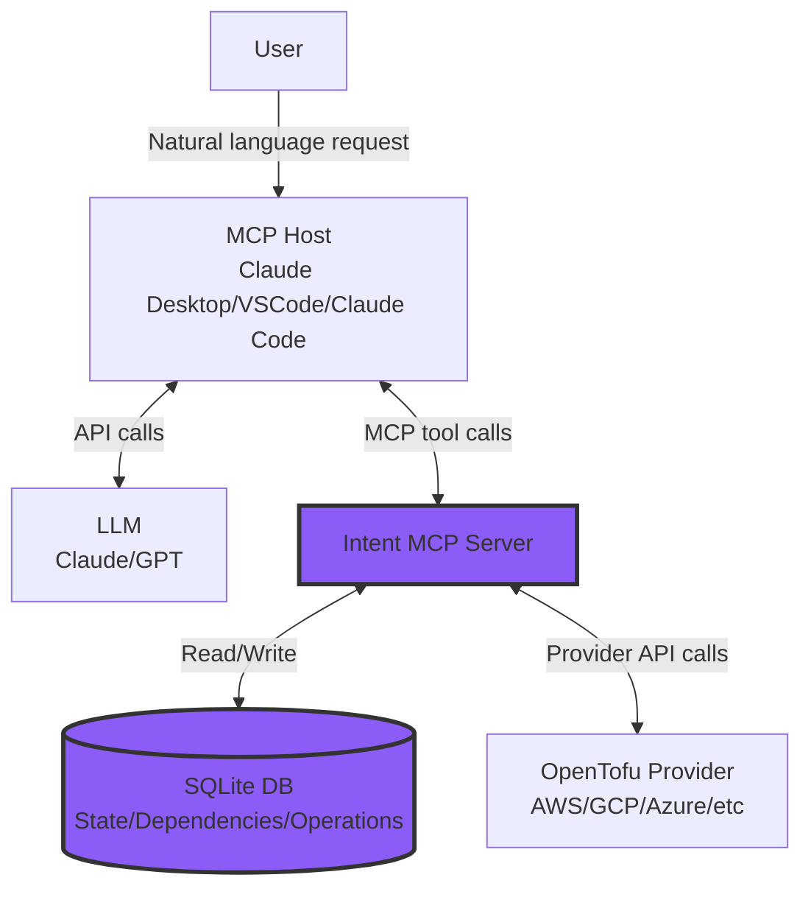

# Spacelift Intent

Welcome to the Spacelift Intent open-source project! Intent is an MCP Server, that lets infrastructure engineers describe what they need in natural language and provisions it directly through calling provider APIs — skipping the Terraform/OpenTofu configuration layer entirely. It’s early and experimental, so expect rough edges, but that’s where you come in: try it out, tell us what works (and what doesn’t), and join the conversation in GitHub Discussions. This repo hosts the open-source core; there's also a fully managed version, built into Spacelift Platform - check out Spacelift Intent HERE.

TODO: record a short gif ?

## Table of contents

- [Installation](#installation)
  - [VSCode](#vscode)
  - [Claude Desktop](#claude-desktop)
  - [Claude Code](#claude-code)
- [Configuration](#configuration)
  - [Flags](#flags)
- [Tools](#tools)
- [Architecture](#architecture)
- [Building from Source](#building-from-source)

## Installation

**Prerequisites**:
- A compatible [MCP host](https://modelcontextprotocol.io/docs/learn/architecture#concepts-of-mcp) that supports **stdio** servers.
- The newest binary from the Releases page.

### VSCode

> Enable [MCP support](https://code.visualstudio.com/docs/copilot/customization/mcp-servers#_enable-mcp-support-in-vs-code)

Add following configuration to your VSCode config file:
Run:

```bash
code --add-mcp "{\"name\":\"spacelift-intent\",\"command\": \"<path-to-your-binary>\"}"
```

### Claude Desktop

Add the following configuration to your *Claude Desktop* config file:

**macOS**: `~/Library/Application Support/Claude/claude_desktop_config.json`
**Windows**: `%APPDATA%\Claude\claude_desktop_config.json`
**Linux**: `~/.config/claude/claude_desktop_config.json`

```json
{
    "mcpServers": {
        "spacelift-intent": {
            "command": "<path-to-your-binary>"
        }
    }
}
```

### Claude Code

```bash
claude mcp add spacelift-intent -- <path-to-your-binary>
```

## Configuration

Before you start to provision new resources, you need to provide credentials for the provider of your choice. You can do that by suplementing environment variables, the same way you'd do it for Terraform/OpenTofu configuration.

Example *Claude Desktop* configuration for **AWS provider**:
```json
{
    "mcpServers": {
        "spacelift-intent": {
            "command": "<path-to-your-binary>",
            "env": {
                "AWS_ACCESS_KEY_ID": "anaccesskey",
                "AWS_SECRET_ACCESS_KEY": "asecretkey",
                "AWS_REGION": "us-west-2"
            }
        }
    }
}
```

### Flags

You can modify the behavior of Intent server by setting up:

| Flag | Environment Variable | Default | Description |
|------|---------------------|---------|-------------|
| `--tmp-dir` | `TMP_DIR` | `/tmp/spacelift-intent-executor` | Temporary directory for provider binaries and state |
| `--db-dir` | `DB_DIR` | `./.state/` | Directory containing DB files for persistent state |

Example *Claude Desktop* configuration:
```json
{
    "mcpServers": {
        "spacelift-intent": {
            "command": "<path-to-your-binary>",
            "env": {
                "TMP_DIR": "/custom/tmp/path",
                "DB_DIR": "/custom/db/path"
            }
        }
    }
}
```

## Tools

Intent provides infrastructure-oriented MCP tools that help with the provisioning process:

| Tool | Category | Description |
|------|----------|-------------|
| `provider-search` | Provider Discovery | Search for available providers in the OpenTofu registry |
| `provider-describe` | Provider Schema | Show provider configuration, supported resources, and data sources |
| `provider-resources-describe` | Provider Schema | Get schema and documentation for a specific resource type |
| `provider-datasources-describe` | Provider Schema | Get schema and documentation for a specific data source type |
| `lifecycle-resources-create` | Resource Lifecycle | Create a new managed resource and store in state |
| `lifecycle-resources-update` | Resource Lifecycle | Update an existing resource with new configuration |
| `lifecycle-resources-delete` | Resource Lifecycle | Delete an existing resource and remove from state (HIGH RISK) |
| `lifecycle-resources-refresh` | Resource Lifecycle | Refresh resource by reading current state to detect drift |
| `lifecycle-resources-import` | Resource Lifecycle | Import existing external resources into state |
| `lifecycle-resources-operations` | Resource Lifecycle | List operations performed on resources with filtering |
| `lifecycle-datasources-read` | Data Sources | Read data from any data source type (read-only) |
| `state-get` | State Management | Get stored state for a resource including dependencies |
| `state-list` | State Management | List all stored resource states |
| `state-eject` | State Management | Remove resource from state without deleting infrastructure |
| `state-timeline` | State Management | Get state timeline events with filtering and pagination |
| `lifecycle-resources-dependencies-add` | Dependency Management | Add a dependency relationship between two resources |
| `lifecycle-resources-dependencies-get` | Dependency Management | Get dependency relationships for a resource |
| `lifecycle-resources-dependencies-remove` | Dependency Management | Remove a dependency relationship (MEDIUM RISK) |

## Architecture

Intent MCP server is translating MCP requests (crafted by your LLM) to a deterministic provider plugin call. During the process, it stores all relevant information in a SQLite Database. The information it stores is:

- `state_records` - resource attributes for the future provider calls, saved during `lifecycle-resources-create` call
- `dependency_edges` - arbitrary dependencies add by calling `lifecycle-resources-dependencies-add` tool
- `timeline_events` - save/delete state events
- `operations` - each MCP tool call is a separate operation stored in the DB

*Highlighted components are implemented by this repository*



## Building from Source

1. Generate code and build the project:

```bash
go generate ./... && make build
```

2. The binary will be available at `./bin/spacelift-intent`

3. Configure your MCP host to use the local binary (see [Installation](#installation) section)

